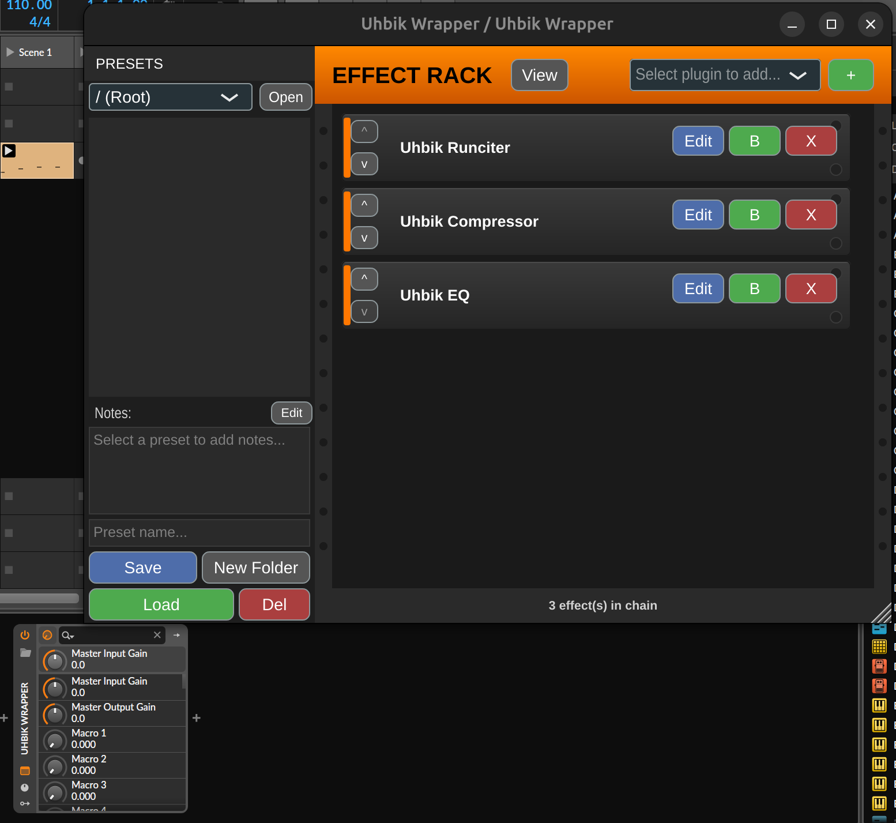

# Uhbik Wrapper

A lightweight, "Reason-style" VST3 wrapper designed specifically for hosting **U-he Uhbik** and other VST3 effects. It provides a transparent, "Combinator-like" interface that allows you to chain multiple effects together and manage them as a single meta-preset.


## Features

*   **Effect Chain**: Load unlimited VST3 effects in series
*   **Plugin Scanner**: Automatically discovers all VST3 plugins in `~/.vst3/`
*   **Rack-Style GUI**: Dark rack interface with orange header, inspired by hardware rack units
*   **Per-Effect Controls**:
    - **Edit**: Opens the plugin's native GUI in a popup window
    - **Bypass**: Toggle effect on/off without removing it
    - **Remove**: Delete effect from chain
    - **Reorder**: Move effects up/down in the chain
    - **Wet/Dry Mix**: Parallel processing control (0-100%)
    - **Gain**: Per-effect gain staging (-24dB to +24dB)
*   **DAW Integration**: Full parameter exposure to host DAW
    - 8 Macro knobs (automatable, ready for parameter mapping)
    - Per-slot bypass, wet/dry, and gain controls
    - Master input/output gain
*   **Preset Browser**: Always-visible folder-based preset browser with:
    - Hierarchical folder navigation
    - Click to select, Load button to apply presets
    - Save presets with custom names
    - Create new folders for organization
    - Delete presets/folders with confirmation
    - Open folder in file manager
    - Per-preset notes with Edit popup
*   **Preset System**: Save and load entire effect chains as `.uhbikchain` files
*   **UI Zoom**: Scale the interface from 100% to 300%
*   **Transparent Hosting**: Passes audio directly through the chain with zero added coloration

## DAW Parameter Panel

All parameters are exposed to your DAW for automation:



*Parameters visible in Bitwig: Master gain, 8 Macro knobs, and per-slot controls (bypass, wet/dry, gain) for 16 effect slots.*

## Prerequisites (Linux)

To build this project, you need the following system libraries:
*   **C++ Compiler**: GCC (g++)
*   **Build Tools**: CMake, pkg-config
*   **Audio/GUI Libraries**: libfreetype6, libasound2, libx11, libxcomposite, libxcursor, libxinerama, libxext, libxrandr, libglu1-mesa, libgtk-3

## Quick Start / Build

The project includes an automated setup script that installs dependencies and compiles the plugin.

1.  Open a terminal in the project directory.
2.  Run the setup script:
    ```bash
    ./setup.sh
    ```
3.  Once the build says **"BUILD COMPLETE"**, the VST3 plugin will be installed at:
    `~/.vst3/Uhbik Wrapper.vst3`

## Usage

1.  **Load in DAW**: The plugin auto-installs to `~/.vst3/` so your DAW should find it automatically
2.  **Add Effects**: Use the dropdown to select a plugin, it will be added automatically
3.  **Edit Effects**: Click "Edit" on any effect to open its native GUI
4.  **Reorder**: Use the up/down arrows to change effect order
5.  **Preset Browser** (left panel):
    - Select a folder from the dropdown to navigate
    - Click a preset to select it, then click "Load" to apply
    - Double-click a preset to load it immediately
    - Type a name and click "Save" to save current chain
    - Click "New Folder" to create subfolders
    - Click "Edit" next to Notes to add preset descriptions
6.  **Zoom**: View menu > select zoom level (100%, 150%, 200%, 300%)

Presets are stored in `~/Documents/UhbikWrapper/Presets/`

## Project Structure

*   `Source/PluginProcessor.cpp`: Effect chain management and audio processing
*   `Source/PluginProcessor.h`: Data structures for effect slots
*   `Source/PluginEditor.cpp`: Main rack GUI and controls
*   `Source/PluginEditor.h`: Editor component declarations
*   `Source/EffectSlot.cpp`: Individual effect slot UI component
*   `Source/EffectSlot.h`: Slot component with Edit/Bypass/Remove buttons
*   `Source/PresetBrowser.cpp`: Folder-based preset browser component
*   `Source/PresetBrowser.h`: Preset browser with save/load/notes functionality
*   `CMakeLists.txt`: Build configuration that fetches JUCE automatically
*   `setup.sh`: Automated dependency installer and builder

## Roadmap

### Completed
- [x] **Plugin Chaining**: Support loading multiple effects in series
- [x] **Preset Serialization**: Save and load entire chain state
- [x] **Plugin Scanner**: Discover available VST3 plugins
- [x] **Effect Reordering**: Move effects up/down in the chain
- [x] **UI Zoom**: Scale interface for different screen sizes
- [x] **Preset Browser**: Folder-based preset organization with notes, delete, open folder
- [x] **DAW Parameter Exposure**: All parameters visible in Bitwig/DAW parameter panel
- [x] **Macro Knobs (8)**: Automatable knobs exposed to DAW (mapping UI pending)
- [x] **Per-Slot Bypass Parameters**: Automatable bypass per effect slot
- [x] **Wet/Dry Mix**: Per-effect parallel processing control
- [x] **Input/Output Gain**: Per-effect gain staging (-24dB to +24dB)
- [x] **Master Input/Output Gain**: Global gain controls

### Visualizations (Planned)
- [ ] **Level Meters**: Per-effect input/output meters with peak hold
- [ ] **Master Meters**: Input/output meters in footer
- [ ] **Spectrum Analyzer**: Popup FFT display per effect and master output

### Macro Mapping UI (Planned)
- [ ] **Macro Assignment UI**: Right-click to map macros to hosted plugin parameters

### MIDI (Planned)
- [ ] **MIDI Learn**: Map hardware MIDI CC to macro knobs

### Platform Support (Planned)
- [ ] **Cross-Platform**: Windows/macOS VST3 path support

## License

Open Source - MIT License
