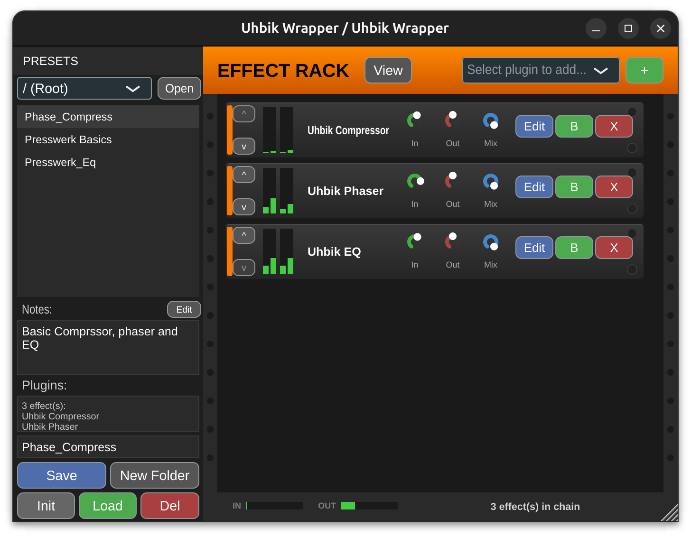

# Uhbik Wrapper

A lightweight, "Reason-style" VST3 wrapper designed specifically for hosting **U-he Uhbik** and other VST3 effects. It provides a transparent, "Combinator-like" interface that allows you to chain multiple effects together and manage them as a single meta-preset.

**Available formats:** VST3, AU (macOS)



## Features

*   **Effect Chain**: Load unlimited VST3 effects in series
*   **Plugin Scanner**: Automatically discovers all VST3 plugins in `~/.vst3/`
*   **Rack-Style GUI**: Dark rack interface with orange header, inspired by hardware rack units
*   **Per-Effect Controls**:
    - **Edit**: Opens the plugin's native GUI in a popup window
    - **Bypass**: Toggle effect on/off without removing it
    - **Remove**: Delete effect from chain
    - **Reorder**: Move effects up/down in the chain
*   **Preset Browser**: Always-visible folder-based preset browser with:
    - Hierarchical folder navigation
    - Click to select, Load button to apply presets
    - Save presets with metadata (name, author, tags, notes)
    - Edit preset metadata and rename presets
    - Shows plugin list for each preset
    - Create new folders for organization
    - Delete presets/folders with confirmation
    - Open folder in file manager
*   **DAW Parameters**: Exposed to host for automation:
    - Input/Output Gain (-24 to +24 dB)
    - Dry/Wet Mix (0-100%)
    - 8 Macro knobs (for future parameter mapping)
*   **Preset System**: Save and load entire effect chains as `.uhbikchain` XML files
*   **UI Zoom**: Scale the interface from 100% to 300% (persisted across sessions)
*   **Sidechain Support**: Routes DAW sidechain input to hosted plugins
*   **Transparent Hosting**: Passes audio directly through the chain with zero added coloration
*   **Thread-Safe Processing**: Uses SpinLock synchronization for stable audio processing

## Building

### Automated Builds (GitHub Actions)
Every push to master triggers builds for Linux, Windows, and macOS.
Download artifacts from the Actions tab on GitHub.

### Manual Build (Any Platform)
```bash
cmake -B build -DCMAKE_BUILD_TYPE=Release
cmake --build build --config Release
```

### Platform-Specific Notes

**Linux** (run `./setup.sh` to install dependencies automatically):
```bash
./setup.sh
```
Install location: `~/.vst3/UhbikWrapper.vst3`

Prerequisites:
*   **C++ Compiler**: GCC (g++)
*   **Build Tools**: CMake, pkg-config
*   **Audio/GUI Libraries**: libfreetype6, libasound2, libx11, libxcomposite, libxcursor, libxinerama, libxext, libxrandr, libglu1-mesa, libgtk-3

**Windows**:
*   Requires Visual Studio 2019+ or Build Tools for Visual Studio
*   Install VST3 to `C:\Program Files\Common Files\VST3\`

**macOS**:
*   Requires Xcode Command Line Tools (`xcode-select --install`)
*   Builds VST3 and AU formats
*   Install VST3 to `/Library/Audio/Plug-Ins/VST3/`
*   Install AU to `/Library/Audio/Plug-Ins/Components/`

**macOS Gatekeeper (important!):** Downloaded plugins are quarantined. Remove the quarantine flag:
```bash
# Remove quarantine from all plugins in the folder
xattr -cr "/Library/Audio/Plug-Ins/VST3"

# Re-sign (ad-hoc) and clear cache
sudo codesign --force --deep --sign - "/Library/Audio/Plug-Ins/VST3/UhbikWrapper.vst3"
```
Then rescan plugins in your DAW (Bitwig: Settings → Locations → Clear cache → Rescan).

## Usage

1.  **Load in DAW**: The plugin auto-installs to `~/.vst3/` so your DAW should find it automatically
2.  **Add Effects**: Use the dropdown to select a plugin, it will be added automatically
3.  **Edit Effects**: Click "Edit" on any effect to open its native GUI
4.  **Reorder**: Use the up/down arrows to change effect order
5.  **Preset Browser** (left panel):
    - Select a folder from the dropdown to navigate
    - Click a preset to select it, then click "Load" to apply
    - Double-click a preset to load it immediately
    - Click "Save" to save current chain with metadata (name, author, tags, notes)
    - Click "Edit" to modify preset metadata or rename
    - Selecting a preset shows its plugin list and metadata
    - Click "New Folder" to create subfolders
6.  **Zoom**: View menu > select zoom level (100%, 150%, 200%, 300%)
7.  **Debug Logging**: View menu > toggle debug logging to stderr

Presets are stored in `~/Documents/UhbikWrapper/Presets/`

## Project Structure

*   `Source/PluginProcessor.cpp`: Effect chain management and audio processing
*   `Source/PluginProcessor.h`: Data structures for effect slots
*   `Source/PluginEditor.cpp`: Main rack GUI and controls
*   `Source/PluginEditor.h`: Editor component declarations
*   `Source/PresetBrowser.cpp`: Preset browser with metadata support
*   `Source/EffectSlot.cpp`: Per-effect slot UI component
*   `CMakeLists.txt`: Build configuration that fetches JUCE automatically
*   `setup.sh`: Automated dependency installer and builder

## Development

### Branching Strategy

- **`master`** - Stable release branch. Only merge when ready to release.
- **`new_features`** - Development branch for new features and fixes.

**Workflow:**
1. Create/checkout `new_features` branch for development
2. Make changes and test locally
3. Push to `new_features` - CI builds will run automatically
4. When ready, merge `new_features` → `master`
5. Tag for release (see below)

```bash
# Start new work
git checkout new_features
git pull origin new_features

# ... make changes ...

git add .
git commit -m "Add feature X"
git push origin new_features

# When ready to release
git checkout master
git merge new_features
git push origin master
```

### Creating Releases

Releases are automated via GitHub Actions. When you push a version tag, the CI will:
1. Build for Linux, Windows, and macOS
2. Create zip files for each platform
3. Publish a GitHub Release with all downloads

**To create a release:**
```bash
git checkout master
git tag v0.2.0
git push --tags
```

The release will appear at: https://github.com/dlarseninclusive/UhbikWrapper/releases

### CI/CD

- **On push to any branch**: Builds all platforms, uploads artifacts
- **On push to `v*` tag**: Builds + creates GitHub Release with zips
- **Manual trigger**: Available via Actions tab → "Run workflow"

## Roadmap

### Completed
- [x] **Plugin Chaining**: Support loading multiple effects in series
- [x] **Preset Serialization**: Save and load entire chain state with metadata
- [x] **Plugin Scanner**: Discover available VST3 plugins
- [x] **Effect Reordering**: Move effects up/down in the chain
- [x] **UI Zoom**: Scale interface for different screen sizes (persisted)
- [x] **Preset Browser**: Folder-based preset organization with metadata
- [x] **Preset Metadata**: Author, tags, notes, plugin list stored in XML
- [x] **Thread-Safe Audio**: SpinLock-based synchronization for stable hosting
- [x] **Sidechain Passthrough**: Routes DAW sidechain input to hosted plugins
- [x] **DAW Parameters**: Input/output gain, dry/wet mix, 8 macro knobs exposed via APVTS
- [x] **Cross-Platform Builds**: GitHub Actions CI for Linux, Windows, macOS
- [x] **Plugin Availability Filter**: Highlight presets with missing plugins (orange + warning icon)
- [x] **Per-Effect Mixing**: Input/output gain and wet/dry mix per effect slot
- [x] **Level Meters**: Per-effect input/output meters and master meters in footer
- [x] **Built-in Ducker**: Sidechain-triggered volume ducking with threshold, amount, attack, release, hold

### Ducker (Planned)
- [ ] **Ducker Presets**: Save/load ducker settings independently from effect chain

### DAW Integration (Planned)
- [ ] **Macro Parameter Mapping**: Map macro knobs to hosted plugin parameters
- [ ] **Per-Slot DAW Parameters**: Expose bypass, wet/dry, gain per slot to DAW automation

### Visualizations (Planned)
- [ ] **Spectrum Analyzer**: Popup FFT display per effect and master output

### MIDI (Planned)
- [ ] **MIDI Learn**: Map hardware MIDI CC to macro knobs
- [ ] **Macro Assignment UI**: Right-click to map macros to hosted plugin parameters

### State Management (Planned)
- [ ] **Undo/Redo**: Undo changes to effect chain and parameters

### Plugin Formats (Planned)
- [ ] **CLAP Format Export**: Currently disabled due to sidechain bus compatibility issues with clap-juce-extensions
- [ ] **CLAP Plugin Hosting**: Load CLAP plugins in addition to VST3

### Platform Support (Planned)
- [ ] **Code Signing**: macOS notarization and Windows signing for distribution

## Known Issues

None currently.

## License

Open Source - MIT License
